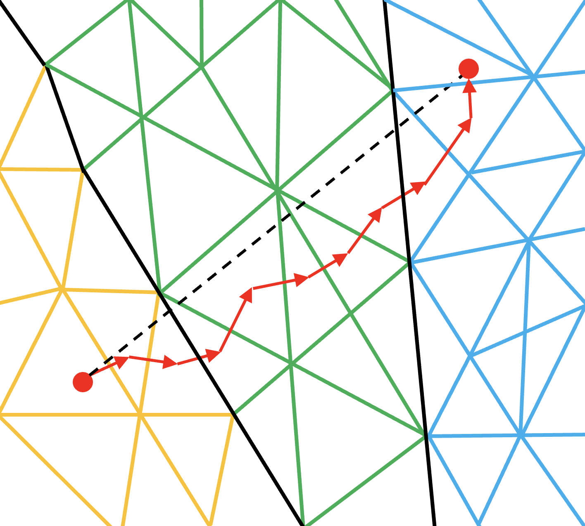
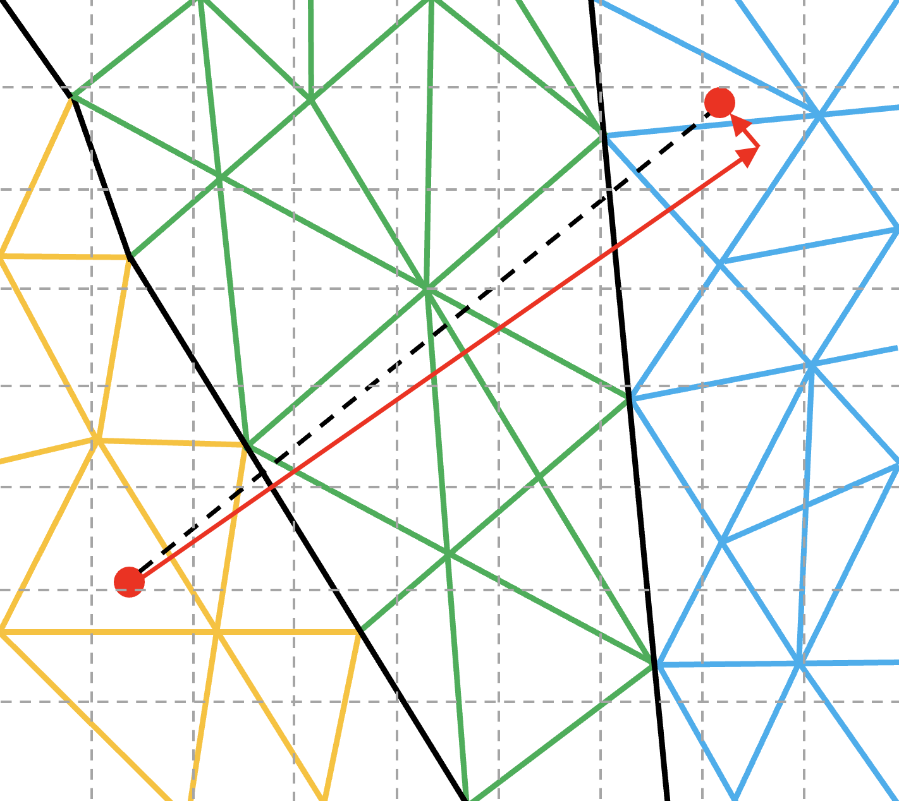

Developer Guide
===============

This page provides a tutorial in the basics of using OP-PIC for unstructured-mesh PIC application development.

Example Application
-------------------

The tutorial will use the FemPIC application, an electrostatic 3D unstructured mesh finite element PIC code (https://github.com/ExCALIBUR-NEPTUNE/Documents/blob/main/reports/2057699/TN-03-3.pdf).

It is based on tetrahedral mesh cells, nodes and faces forming a duct. 
Faces on one end of the duct are designated as inlet faces and the outer wall is fixed at a higher potential to retain the ions within the duct. 
Charged particles are injected at a constant rate from the inlet faces of the duct (one-stream) at a fixed velocity, and the particles move through the duct under the influence of the electric field. 
The particles are removed when they leave the boundary face. Overall Mini-FEM-PIC has 1 degree of freedom (DOF) per cell, 2 DOFs per node and 7 DOFs per particle.

FemPIC consists of six main loops, ``inject_ions`` , ``calculate_new_pos_vel`` , ``move`` , ``deposit_charge_on_nodes``, ``compute_node_charge_density`` and ``compute_electric_field``, within a time-marching iterative loop. 
Additionally, it contain a ``init_boundary_pot`` loop and a ``get_final_max_values`` loop used during initialzing and finalizing stages.
In addition to the above loops, FemPIC consists of a linear sparse matrix field solver, which is implemented using PETSc library.

Out of these, ``compute_node_charge_density``, ``init_boundary_pot`` and ``get_final_max_values`` are what we classify as direct loops where all the data accessed in the loop is defined on the mesh element over which the loop iterates over. 
Thus for example in a direct loop, a loop over nodes will only access data defined on nodes. 

All the other loops are indirect loops. 
In this case when looping over a given type of elements, data on other types of elements will be accessed indirectly, using mapping tables. 
There are two types of indirect loops. 
The ``compute_electric_field`` loop iterates over cells and read data on nodes, accessing them indirectly via a mapping table that gives the explicit connectivity information between cells and nodes. 
Similarly, ``calculate_new_pos_vel`` loop iterates over particles and read data on cells, accessing them indirectly via a mapping between particles and cells.
The other kind of indirect loop is double-indirect. 
For example ``deposit_charge_on_nodes`` loop iterates over particles and increments data on nodes. But these nodes are not directly related to particles though one mapping. 
Thus we may need to use two mappings, the first from particles to cells (p2c_map) and the second from cells to nodes (c2n_map).

Within these above mentioned loop, there is a special loop which will move particles to cells accoring to the particle position, and the further details will be discussed in a later section.

* Go to the ``OP-PIC/app_fempic`` directory and open the ``fempic.cpp`` file to view the original application.
* Use the information in the readme file of that directory to code-generate and run the application.

Original - Load mesh and initialization
---------------------------------------
The original code begins with allocating memory to hold the mesh data and then initializing them by reading in the mesh data, form the text file. 

In this tutorial, the main focus is to show how the OP-PIC API is used, hence the user may implement their own code for mesh loading.

Go to the ``OP-PIC/app_fempic/fempic_misc_mesh_loader.h`` to see the complete mesh loader, where we use the original fempic code to read from file and store in the data storage class ``DataPointers``.

.. code-block:: c++

    std::shared_ptr<DataPointers> m = load_mesh();

Step 1 - Preparing to use OP-PIC
--------------------------------

First, include the following header files, then initialize OP-PIC and finalize it as follows:

.. code-block:: c++

    #include "opp_templates.h"
    ...
    ...
    int main(int argc, char **argv) {
        opp_init(argc, argv); //Initialise the OP-PIC library, passing runtime args
        {
            ...
            ...
            ...
        }  
        opp_exit(); //Finalising the OP-PIC library
    }

Step 2 - OP-PIC Declaration
---------------------------
**Declare sets** - 
The FemPIC application consists of three mesh element types (which we call sets): ``cells``, ``nodes``, and ``inlet-faces``. 
These needs to be declared using the ``opp_decl_set`` API call together with the number of elements for each of these sets.

In addition, FemPIC contains a particle set, that is defined using ``opp_decl_particle_set`` API call together with the number of particles and a mesh cell set. 

The speciality of a particle set is that they can be resized (the set size can be increased or reduced during the simulation).
Other than the main particle set, we have used a temporary dummy particle set to hold some random data for particle injection initialization.

.. code-block:: c++

    // declare sets
    opp_set node_set       = opp_decl_set(m->n_nodes, "mesh_nodes");
    opp_set cell_set       = opp_decl_set(m->n_cells, "mesh_cells");
    opp_set iface_set      = opp_decl_set(m->n_ifaces, "inlet_faces_cells");
    opp_set particle_set   = opp_decl_particle_set("particles", cell_set); 
    opp_set dummy_part_set = opp_decl_particle_set("dummy particles", cell_set);

Later, we will see how the number of mesh elements can be read in directly from an hdf5 file using the ``opp_decl_set_hdf5`` and ``opp_decl_particle_set_hdf5`` call.

When developing your own application with OP-PIC, or indeed converting an application to use OP-PIC, you will need to decide on what mesh element types, i.e. sets will need to be declared to define the full mesh. 
A good starting point for this design is to see what mesh elements are used the loops over the mesh.

**Declare maps** - Looking at the original Mini-FEM-PIC application's loops we see that mappings between cells and nodes, cells and cells, inlet-faces and nodes, inlet-faces and cells, and cells and nodes are required. 
In addition, a particles to cells mapping is required. 

This can be observed by the indirect access to data in each of the loops in the main iteration loops. 
These connectivity information needs to be declared via the ``opp_decl_map`` API call:

.. code-block:: c++

    //declare maps
    opp_map c2n_map  = opp_decl_map(cell_set,  node_set, 4, m->c_to_n, "c_v_n_map");
    opp_map c2c_map  = opp_decl_map(cell_set,  cell_set, 4, m->c_to_c,  "c_v_c_map"); 
    opp_map if2c_map = opp_decl_map(iface_set, cell_set, 1, m->if_to_c, "if_v_c_map"); 
    opp_map if2n_map = opp_decl_map(iface_set, node_set, 4, m->if_to_n, "if_v_n_map");

    opp_map p2c_map  = opp_decl_map(particle_set, cell_set, 1, nullptr, "p2c_map");

The ``opp_decl_map`` requires the names of the two sets for which the mapping is declared, its arity, mapping data (as in this case allocated in integer blocks of memory) and a string name.
A map created with a particle set is capable of changing its length during the simulation and other maps are static.

Note that we have declared ``p2c_map`` with a ``nullptr`` since ``particle_set`` is defined without a particle count (i.e. zero), since we anticipate to inject particles during the simulation.

**Declare data** - All data declared on sets should be declared using the ``opp_decl_dat`` API call. For FemPIC this consists of seven cell dats, six node dats, six inlet-face dats and three particle dats (+1 dummy particle dat).

.. code-block:: c++

  //declare data on sets
    opp_dat c_det       = opp_decl_dat(cell_set, 16, DT_REAL, m->c_det,      "c_det");  
    opp_dat c_volume    = opp_decl_dat(cell_set, 1,  DT_REAL, m->c_vol,      "c_volume");        
    opp_dat c_ef        = opp_decl_dat(cell_set, 3,  DT_REAL, m->c_ef,       "c_ef");
    opp_dat c_sd        = opp_decl_dat(cell_set, 12, DT_REAL, m->c_sd,       "c_shape_deri"); 
    opp_dat c_gbl_id    = opp_decl_dat(cell_set, 1,  DT_INT,  m->c_id,       "c_gbl_id"); 
    opp_dat c_colors    = opp_decl_dat(cell_set, 1,  DT_INT,  m->c_col,      "c_colors");
    opp_dat c_centroids = opp_decl_dat(cell_set, 3,  DT_REAL, m->c_centroid, "c_centroids");

    opp_dat n_volume     = opp_decl_dat(node_set, 1, DT_REAL, m->n_vol,     "n_vol");        
    opp_dat n_potential  = opp_decl_dat(node_set, 1, DT_REAL, m->n_pot,     "n_potential");     
    opp_dat n_charge_den = opp_decl_dat(node_set, 1, DT_REAL, m->n_ion_den, "n_charge_den");
    opp_dat n_pos        = opp_decl_dat(node_set, 3, DT_REAL, m->n_pos,     "n_pos");     
    opp_dat n_type       = opp_decl_dat(node_set, 1, DT_INT,  m->n_type,    "n_type");
    opp_dat n_bnd_pot    = opp_decl_dat(node_set, 1, DT_REAL, m->n_bnd_pot, "n_bnd_pot");

    opp_dat if_v_norm  = opp_decl_dat(iface_set, 3,  DT_REAL, m->if_v_norm, "iface_v_norm");
    opp_dat if_u_norm  = opp_decl_dat(iface_set, 3,  DT_REAL, m->if_u_norm, "iface_u_norm");
    opp_dat if_norm    = opp_decl_dat(iface_set, 3,  DT_REAL, m->if_norm,   "iface_norm");  
    opp_dat if_area    = opp_decl_dat(iface_set, 1,  DT_REAL, m->if_area,   "iface_area");
    opp_dat if_distrib = opp_decl_dat(iface_set, 1,  DT_INT,  m->if_dist,   "iface_dist");
    opp_dat if_n_pos   = opp_decl_dat(iface_set, 12, DT_REAL, m->if_n_pos,  "iface_n_pos");

    opp_dat p_pos   = opp_decl_dat(particle_set, 3, DT_REAL, nullptr, "p_position");
    opp_dat p_vel   = opp_decl_dat(particle_set, 3, DT_REAL, nullptr, "p_velocity");
    opp_dat p_lc    = opp_decl_dat(particle_set, 4, DT_REAL, nullptr, "p_lc");

    opp_dat dp_rand = opp_decl_dat(dummy_part_set, 2, DT_REAL, nullptr, "dummy_part_rand");

Note that we have declared particle dats with a ``nullptr`` since ``particle_set`` is defined without a particle count (i.e. zero), since we anticipate to inject particles during the simulation.

**Declare constants** - Finally global constants that are used in any of the computations in the loops needs to be declared.
This is required due to the fact that when using code-generation later for parallelizations such as on GPUs (e.g. using CUDA or HIP), global constants needs to be copied over to the GPUs before they can be used in a GPU kernel. 

Declaring them using the ``opp_decl_const<type>`` API call will indicate to the OP-PIC code-generator that these constants needs to be handled in a special way, generating code for copying them to the GPU for the relevant back-ends.
The template types could be ``OPP_REAL``, ``OPP_INT``, ``OPP_BOOL``.

.. code-block:: c++

    //declare global constants
    opp_decl_const<OPP_REAL>(1, &spwt,           "CONST_spwt");
    opp_decl_const<OPP_REAL>(1, &ion_velocity,   "CONST_ion_velocity");
    opp_decl_const<OPP_REAL>(1, &dt,             "CONST_dt");
    opp_decl_const<OPP_REAL>(1, &plasma_den,     "CONST_plasma_den");
    opp_decl_const<OPP_REAL>(1, &mass,           "CONST_mass");
    opp_decl_const<OPP_REAL>(1, &charge,         "CONST_charge");
    opp_decl_const<OPP_REAL>(1, &wall_potential, "CONST_wall_potential");

The constants can be accessed in the kernels with the same literals used in the string name. 
An example can be seen in the next section (Step 3).

Step 3 - Parallel loop : ``opp_par_loop``
------------------------------------------

(a) Direct loop
~~~~~~~~~~~~~~~

We can now convert a direct loop to use the OP-PIC API. 

We have chosen ``compute_node_charge_density`` to demostrate a direct loop.
It iterates over nodes, ``multiply node_charge_den`` with (``CONST_spwt`` / ``node_volume``) and saves to multiply ``node_charge_den``.

.. code-block:: c++

    //compute_node_charge_density : iterates over nodes
    for (int iteration = 0; iteration < (nnodes * 1); ++iteration) {
        node_charge_den[iteration] *= (CONST_spwt[0] / node_volume[iteration]);
    }

This is a direct loops due to the fact that all data accessed in the computation are defined on the set that the loop iterates over. In this case the iteration set is nodes.

To convert to the OP-PIC API we first outline the loop body (elemental kernel) to a subroutine:

.. code-block:: c++

    //outlined elemental kernel
    inline void compute_ncd_kernel(double *ncd, const double *nv) {
        ncd[0] *= (CONST_spwt[0] / nv[0]);
    }
    //compute_node_charge_density : iterates over nodes
    for (int iteration = 0; iteration < (nnodes * 1); ++iteration) {
        compute_ncd_kernel(&node_charge_den[iteration], &node_volume[iteration]);
    }

Now we can directly declare the loop with the ``opp_par_loop`` API call:

.. code-block:: c++

    //outlined elemental kernel
    inline void compute_ncd_kernel(double *ncd, const double *nv) {
        ncd[0] *= (CONST_spwt[0] / nv[0]);
    }

    opp_par_loop(compute_ncd_kernel, "compute_node_charge_density", node_set, OPP_ITERATE_ALL,
        opp_arg_dat(n_charge_den,  OPP_RW), 
        opp_arg_dat(n_volume,      OPP_READ));

Note how we have:

- indicated the elemental kernel ``compute_ncd_kernel`` in the first argument to ``opp_par_loop``.
- used the ``opp_dat``s names ``n_charge_den`` and ``n_volume`` in the API call.
- noted the iteration set ``node_set`` (3rd argument) and iteration type ``OPP_ITERATE_ALL`` (4th argument).
- indicated the direct access of ``n_charge_den`` and ``n_volume`` without any mappings provided to ``opp_arg_dat``.
- indicated that ``n_volume`` is read only (``OP_READ``) and ``n_charge_den`` is read & write (``OPP_RW``), by looking through the elemental kernel and identifying how they are used/accessed in the kernel.
- given that ``n_volume`` is read only we also indicate this by the key word ``const`` for ``compute_ncd_kernel`` elemental kernel.
- note that we have accessed a const value ``CONST_spwt`` that we declared using ``opp_decl_const<OPP_REAL>()`` API call.

(b) Indirect loop (single indirection)
~~~~~~~~~~~~~~~~~~~~~~~~~~~~~~~~~~~~~~

We have selected two loops in FemPIC to demonstrate single indirections. 

First, we use ``compute_electric_field`` calculation to showcase the mesh set to mesh set mapping indirections.
Here we iterate over cells set, access node potentials through indirect accesses using ``c2n_map``.
Note that one cell in FemPIC is linked with 4 surrounding nodes and ``n_potential`` has a dimension of one.

.. code-block:: c++

    //compute_electric_field : iterates over cells
    for (int iter = 0; iter < ncell; ++iter) {
        const int map1idx = c2n_map[iter * 4 + 0];
        const int map2idx = c2n_map[iter * 4 + 1];
        const int map3idx = c2n_map[iter * 4 + 2];
        const int map4idx = c2n_map[iter * 4 + 3];
        
        for (int dim = 0; dim < 3; dim++) { 
            c_ef[3 * iter + dim] = c_ef[12 * iter + dim] - 
                ((c_sd[12 * iter + (0 + dim)] * n_potential[map1idx * 1 + 0])) + 
                (c_sd[12 * iter + (3 + dim)] * n_potential[map2idx * 1 + 0])) +
                (c_sd[12 * iter + (6 + dim)] * n_potential[map3idx * 1 + 0])) + 
                (c_sd[12 * iter + (9 + dim)] * n_potential[map4idx * 1 + 0])));
        }
    }

Similar to the direct loop, we outline the loop body and call it within the loop as follows:

.. code-block:: c++

    //outlined elemental kernel
    inline void compute_ef_kernel(
        double *c_ef, const double *c_sd, const double *n_pot0,
        const double *n_pot1, const double *n_pot2, const double *n_pot3) {
        
        for (int dim = 0; dim < 3; dim++) { 
            c_ef[dim] = c_ef[dim] - 
                ((c_sd[0 + dim] * n_pot0[0])) + (c_sd[3 + dim] * n_pot1[0])) +
                (c_sd[6 + dim] * n_pot2[0])) + (c_sd[9 + dim] * n_pot3[0])));
        }    
    }
    //compute_electric_field : iterates over cells
    for (int iter = 0; iter < ncell; ++iter) {
        const int map1idx = c2n_map[iter * 4 + 0];
        const int map2idx = c2n_map[iter * 4 + 1];
        const int map3idx = c2n_map[iter * 4 + 2];
        const int map4idx = c2n_map[iter * 4 + 3];

        compute_ef_kernel(&c_ef[3 * iter], &c_sd[12 * iter], &n_potential[1 * map1idx],
            &n_potential[1 * map2idx], &n_potential[1 * map3idx], &n_potential[1 * map4idx]);
    }

Now, convert the loop to use the ``opp_par_loop`` API:

.. code-block:: c++

    //outlined elemental kernel
    inline void compute_ef_kernel(
        double *c_ef, const double *c_sd, const double *n_pot0,
        const double *n_pot1, const double *n_pot2, const double *n_pot3) {
        
        for (int dim = 0; dim < 3; dim++) { 
            c_ef[dim] = c_ef[dim] - 
                ((c_sd[0 * 3 + dim] * n_pot0[0])) + (c_sd[1 * 3 + dim] * n_pot1[0])) +
                (c_sd[2 * 3 + dim] * n_pot2[0])) + (c_sd[3 * 3 + dim] * n_pot3[0])));
        }    
    }

    opp_par_loop(compute_ef_kernel, "compute_electric_field", cell_set, OPP_ITERATE_ALL,
        opp_arg_dat(c_ef,                    OPP_RW), 
        opp_arg_dat(c_sd,                    OPP_READ),
        opp_arg_dat(n_potential, 0, c2n_map, OPP_READ),
        opp_arg_dat(n_potential, 1, c2n_map, OPP_READ),
        opp_arg_dat(n_potential, 2, c2n_map, OPP_READ),
        opp_arg_dat(n_potential, 3, c2n_map, OPP_READ));

Note in this case how the indirections are specified using the mapping declared as ``opp_map`` ``c2n_map``, indicating the to-set index (2nd argument), and access mode ``OPP_READ``.

That is, the thrid argument of the ``opp_par_loop`` is a read-only argument mapped from cells to nodes using the mapping at the 0th index of c2n_map (i.e. 1st mapping out of 4 nodes attached).
Likewise, the fourth argument of ``opp_par_loop`` is mapped from cells to nodes using the mapping at the 1th index of ``c2n_map`` (i.e. 2nd mapping out of 4 nodes attached) and so on.

Second, we use ``calculate_new_pos_vel`` calculation to showcase the particle set to mesh set mapping indirections.
Here we iterate over particles set, access cell electric fields through indirect accesses using ``p2c_map``.
Note that one particle in FemPIC can be linked with only only one cell.

.. code-block:: c++

    //calculate_new_pos_vel : iterates over cells
    for (int iter = 0; iter < nparticles; ++iter) {
        const int p2c = p2c_map[iter];
        const double coef = CONST_charge[0] / CONST_mass[0] * CONST_dt[0];
        for (int dim = 0; dim < 3; dim++) {
            p_vel[3 * iter + dim] += (coef * c_ef[3 * p2c * dim]);   
            p_pos[3 * iter + dim] += p_vel[3 * iter + dim] * CONST_dt[0];                
        }
    }

Then, we outline the loop body and call it within the loop as follows:

.. code-block:: c++

    //outlined elemental kernel
    inline void calc_pos_vel_kernel(
        const double *cell_ef, double *part_pos, double *part_vel) {

        const double coef = CONST_charge[0] / CONST_mass[0] * CONST_dt[0];
        for (int dim = 0; dim < 3; dim++) {
            part_vel[dim] += (coef * cell_ef[dim]);   
            part_pos[dim] += part_vel[dim] * (CONST_dt[0]);                
        }  
    }
    //calculate_new_pos_vel : iterates over particles
    for (int iter = 0; iter < nparticles; ++iter) {
        const int p2c = p2c_map[iter];
        calc_pos_vel_kernel(&c_ef[3 * p2c], &p_pos[3 * iter], &p_vel[3 * iter]);
    }

Now, convert the loop to use the ``opp_par_loop`` API:

.. code-block:: c++

    //outlined elemental kernel
    inline void calc_pos_vel_kernel(
        const double *cell_ef, double *part_pos, double *part_vel) {

        const double coef = CONST_charge[0] / CONST_mass[0] * CONST_dt[0];
        for (int dim = 0; dim < 3; dim++) {
            part_vel[dim] += (coef * cell_ef[dim]);   
            part_pos[dim] += part_vel[dim] * (CONST_dt[0]);                
        }  
    }

    opp_par_loop(calc_pos_vel_kernel, "calculate_new_pos_vel", particle_set, OPP_ITERATE_ALL,
        opp_arg_dat(c_ef, p2c_map, OPP_READ),
        opp_arg_dat(p_pos,         OPP_WRITE),
        opp_arg_dat(p_vel,         OPP_WRITE));

Note in this case how the indirections are specified using the mapping declared as ``opp_map`` ``p2c_map``, and access mode ``OPP_READ``.

That is, the first argument of the ``opp_par_loop`` is a read-only argument mapped from particles to cells, however a mapping index is not required since always particles to cells mapping has a dimension of one.

(c) Double Indirect loop
~~~~~~~~~~~~~~~~~~~~~~~~

There could be instances where double indirection is required. 
For example in ``deposit_charge_on_nodes``, we may need to deposit charge from particles to nodes, but from particles we have a single mapping towards the cells, with another mapping from cells to nodes.

Here we iterate over particles set, access node charge density through double-indirect accesses using ``p2c_map`` and ``c2n_map``.
Note that one cell in FemPIC is linked with 4 surrounding nodes and ``n_charge_den`` has a dimension of one.

.. code-block:: c++

    //deposit_charge_on_nodes : iterates over cells
    for (int iter = 0; iter < nparticles; ++iter) {
        const int p2c = p2c_map[iter];
        const int map1idx = c2n_map[p2c * 4 + 0];
        const int map2idx = c2n_map[p2c * 4 + 1];
        const int map3idx = c2n_map[p2c * 4 + 2];
        const int map4idx = c2n_map[p2c * 4 + 3];

        n_charge_den[1 * map1idx] += p_lc[4 * iter + 0];
        n_charge_den[1 * map2idx] += p_lc[4 * iter + 1];
        n_charge_den[1 * map3idx] += p_lc[4 * iter + 2];
        n_charge_den[1 * map4idx] += p_lc[4 * iter + 3];
    }

Similarly, we outline the loop body and call it within the loop as follows:

.. code-block:: c++

    //outlined elemental kernel
    inline void dep_charge_kernel(const double *part_lc, 
        double *node_charge_den0, double *node_charge_den1,
        double *node_charge_den2, double *node_charge_den3) {
    
        node_charge_den0[0] += part_lc[0];
        node_charge_den1[0] += part_lc[1];
        node_charge_den2[0] += part_lc[2];
        node_charge_den3[0] += part_lc[3];   
    }

    //deposit_charge_on_nodes : iterates over cells
    for (int iter = 0; iter < nparticles; ++iter) {
        const int p2c = p2c_map[iter];
        const int map1idx = c2n_map[p2c * 4 + 0];
        const int map2idx = c2n_map[p2c * 4 + 1];
        const int map3idx = c2n_map[p2c * 4 + 2];
        const int map4idx = c2n_map[p2c * 4 + 3];

        dep_charge_kernel(&p_lc[4 * iter], 
            &n_charge_den[1 * map1idx], &n_charge_den[1 * map2idx], 
            &n_charge_den[1 * map3idx], &n_charge_den[1 * map4idx]);
    }

Now, convert the loop to use the ``opp_par_loop`` API:

.. code-block:: c++

    //outlined elemental kernel
    inline void dep_charge_kernel(const double *part_lc, 
        double *node_charge_den0, double *node_charge_den1,
        double *node_charge_den2, double *node_charge_den3) {
    
        node_charge_den0[0] += part_lc[0];
        node_charge_den1[0] += part_lc[1];
        node_charge_den2[0] += part_lc[2];
        node_charge_den3[0] += part_lc[3];   
    }

    opp_par_loop(dep_charge_kernel, "deposit_charge_on_nodes", particle_set, OPP_ITERATE_ALL,
        opp_arg_dat(p_lc,                              OPP_READ),
        opp_arg_dat(n_charge_den, 0, c2n_map, p2c_map, OPP_INC),
        opp_arg_dat(n_charge_den, 1, c2n_map, p2c_map, OPP_INC),
        opp_arg_dat(n_charge_den, 2, c2n_map, p2c_map, OPP_INC),
        opp_arg_dat(n_charge_den, 3, c2n_map, p2c_map, OPP_INC));

Note in this case how the indirections are specified using the mapping declared using two maps ``p2c_map`` and ``c2n_map``, indicating the to-set index (2nd argument), and access mode ``OPP_INC``.

That is, the second argument of the ``opp_par_loop`` is an increment argument mapped from particles to cells and cells to nodes using the mapping at the 0th index of ``c2n_map`` (i.e. 1st mapping out of 4 nodes attached).
Likewise, the thrid argument of ``opp_par_loop`` is mapped from particles to cells and cells to nodes using the mapping at the 1th index of ``c2n_map`` (i.e. 2nd mapping out of 4 nodes attached) and so on.

Step 4 - Move loop : ``opp_particle_move``
------------------------------------------
A key step in a PIC solver is the particle move. 
Here we will first illustrate how a particle mover operates in an unstructured mesh environment.

The main idea of a particle mover is to search and position particles once it is moved to a new position under the influence of electric and magnetic fields.

The first strategy that we discuss here is named as ``Multi-Hop (MH)``. 
It loop over each particle and “track” its movement from cell to cell by computing the next probable cell. 
This entails an inner loop per particle which will terminate when the final destination cell is reached.

To explain this, we use the FemPIC particle move routine.

.. code-block:: c++

    //move_particles : iterates over cells
    for (int iter = 0; iter < nparticles; ++iter) {

        bool search_next_cell = true;
        do {
            const int p2c = p2c_map[iter];
            const int c2c = c2c_map[4 * p2c];

            const double coeff = (1.0 / 6.0) / (c_volume[1 * p2c]);
            for (int i=0; i<4; i++) {
                p_lc[4 * iter + i] = coeff * (c_det[16 * p2c + i * 4 + 0] -
                    c_det[16 * p2c + i * 4 + 1] * p_pos[3 * iter + 0] +
                    c_det[16 * p2c + i * 4 + 2] * p_pos[3 * iter + 1] -
                    c_det[16 * p2c + i * 4 + 3] * p_pos[3 * iter + 2]);
            }
        
            if (!(p_lc[4 * iter + 0] < 0.0 || p_lc[4 * iter + 0] > 1.0 ||
                  p_lc[4 * iter + 1] < 0.0 || p_lc[4 * iter + 1] > 1.0 ||
                  p_lc[4 * iter + 2] < 0.0 || p_lc[4 * iter + 2] > 1.0 ||
                  p_lc[4 * iter + 3] < 0.0 || p_lc[4 * iter + 3] > 1.0)) { // within current cell
                search_next_cell = false;
            }
            else { // outside the last known cell
                int min_i = 0;
                double min_lc = p_lc[4 * iter + 0];
            
                for (int i=1; i < 4; i++) { // find most negative weight
                    if (p_lc[4 * iter + i] < min_lc) {
                        min_lc = p_lc[4 * iter + i];
                        min_i = i;
                    }
                }
            
                if (c2c_map[4 * p2c + min_i] >= 0) { // is there a neighbor in this direction?
                    p2c_map[iter] = c2c_map[4 * p2c + min_i];
                    search_next_cell = true;
                }
                else {
                    // No neighbour cell to search next, particle out of domain, 
                    // Mark and remove from simulation!!!
                    p2c_map[iter] = INT_MAX; 
                    search_next_cell = false;
                }
            }    
        } while (search_next_cell)
    }

Once this move routine is executed, there may be particles with ``INT_MAX`` p2c mapping, which means the data on all the particle dats related to that specific particle index are invalid.

One option is to fill these ``holes`` using valid particle data from the end of the array (we call it hole filling). 

Another option is to sort all the particle arrays according to the p2c_map (desc), which will shift all particles with ``INT_MAX`` p2c mapping to shift to the end. 
This will have benefits of better cache usage, since all particles that maps to the same cell index will be close to each other, however do note that sorting particle dats follow its own performance overhead!

One other option is to shuffle the particles, while shifting the particles with ``INT_MAX`` p2c mapping to the end of the data structure. 
The benefits of doing so in device implementations are elaborated in the Optimization section.

Similar to other parallel loops, we outline the loop body and call it within the loop as follows:

.. code-block:: c++

    //outlined elemental kernel
    inline void move_kernel(bool& search_next_cell, int* p2c, const int* c2c,
            const double *point_pos, double* point_lc,
            const double *cell_volume, const double *cell_det) {

        const double coeff = (1.0 / 6.0) / (cell_volume[0]);
        for (int i=0; i<4; i++) {
            point_lc[i] = coeff * (cell_det[i * 4 + 0] -
                cell_det[i * 4 + 1] * point_pos[0] +
                cell_det[i * 4 + 2] * point_pos[1] -
                cell_det[i * 4 + 3] * point_pos[2]);
        }
    
        if (!(point_lc[0] < 0.0 || point_lc[0] > 1.0 ||
              point_lc[1] < 0.0 || point_lc[1] > 1.0 ||
              point_lc[2] < 0.0 || point_lc[2] > 1.0 ||
              point_lc[3] < 0.0 || point_lc[3] > 1.0)) { // within the current cell
            search_next_cell = false;
            return;
        }
        
        // outside the last known cell
        int min_i = 0;
        double min_lc = point_lc[0];
    
        for (int i=1; i < 4; i++) { // find most negative weight
            if (point_lc[i] < min_lc) {
                min_lc = point_lc[i];
                min_i = i;
            }
        }
    
        if (c2c[min_i] >= 0) { // is there a neighbor in this direction?
            p2c[0] = c2c[min_i];
            search_next_cell = true;
        }
        else {
            // No neighbour cell to search next, particle out of domain, 
            // Mark and remove from simulation!!!
            p2c[0] = INT_MAX; 
            search_next_cell = false;
        } 
    }
    //move_particles : iterates over cells
    for (int iter = 0; iter < nparticles; ++iter) {

        bool search_next_cell = true;
        do {
            const int* p2c = &p2c_map[iter];
            const int* c2c = &c2c_map[4 * p2c[0]];

            move_kernel(search_next_cell, p2c, c2c,
                &p_pos[3 * iter], p_lc[16 * iter],
                &c_volume[1 * p2c[0]], &c_det[1 * p2c[0]]);

        } while (search_next_cell)
    }

Now, convert the loop to use the ``opp_particle_move`` API.

.. code-block:: c++

    //outlined elemental kernel
    inline void move_kernel(const double *point_pos, double* point_lc,
            const double *cell_volume, const double *cell_det) {

        const double coeff = (1.0 / 6.0) / (cell_volume[0]);
        for (int i=0; i<4; i++) {                            // <- (1)
            point_lc[i] = coeff * (cell_det[i * 4 + 0] -
                cell_det[i * 4 + 1] * point_pos[0] +
                cell_det[i * 4 + 2] * point_pos[1] -
                cell_det[i * 4 + 3] * point_pos[2]);
        }
    
        if (!(point_lc[0] < 0.0 || point_lc[0] > 1.0 ||      // <- (2)
              point_lc[1] < 0.0 || point_lc[1] > 1.0 ||
              point_lc[2] < 0.0 || point_lc[2] > 1.0 ||
              point_lc[3] < 0.0 || point_lc[3] > 1.0)) { // within the current cell
            // no additional computations in FemPIC          // <- (3)
            OPP_PARTICLE_MOVE_DONE;
            return;
        }
        
        // outside the last known cell
        int min_i = 0;
        double min_lc = p_lc[0];
    
        for (int i=1; i < 4; i++) { // find most negative weight
            if (point_lc[i] < min_lc) {
                min_lc = point_lc[i];
                min_i = i;
            }
        }

        // is there a neighbor in this direction?
        if (opp_c2c[min_i] >= 0) { 
            opp_p2c[0] = opp_c2c[min_i];                     // <- (5)
            OPP_PARTICLE_NEED_MOVE;
        }
        else {                                               // <- (4)
            // No neighbour cell to search next, particle out of domain, 
            // Mark and remove from simulation!!!
            opp_p2c[0] = INT_MAX; 
            OPP_PARTICLE_NEED_REMOVE;
        }
    }

    opp_particle_move(move_kernel, "move", particle_set, c2c_map, p2c_map,
        opp_arg_dat(p_pos,             OPP_READ),
        opp_arg_dat(p_lc,              OPP_WRITE),
        opp_arg_dat(c_volume, p2c_map, OPP_READ),
        opp_arg_dat(c_det,    p2c_map, OPP_READ));

Note how we have:

- indicated the elemental kernel ``move_kernel`` in the first argument to ``opp_particle_move`` loop.
- used particles_set as the iterating set and provided cell to cell mapping ``c2c_map`` and particle to cell mapping ``p2c_map`` as 4th and 5th arguments of the ``opp_particle_move`` API call.
- by providing ``c2c_map`` and ``p2c_map``, they are accessed within the elemental kernel, using ``opp_c2c`` and ``opp_p2c`` pointers, without the need to explicitly pass as kernel arguments.
- direct, indirect, or double indirect mappings can be provided as opp_arg_dats similar to ``opp_par_loop`` (double indirection not present in this example).
- ``OPP_PARTICLE_MOVE_DONE``, ``OPP_PARTICLE_NEED_MOVE`` and ``OPP_PARTICLE_NEED_REMOVE`` pre-processor statements can be used to indicate the code-generator about the particle move status.

To summarize, the elemental kernel over all particles will require:

(1) specifying computations to be carried out for each mesh element, e.g., cells, along the path of the particle, until its final destination cell; 
(2) a method to identify if the particle has reached its final mesh cell; 
(3) computations to be carried out at the final destination mesh cell; 
(4) actions to be carry out if the particle has moved out of the mesh domain; 
(5) calculate the next most probable cell index to search.

In additon to above, a user can provide a code-block to be executed only once per particle (during the first iteration of the do while loop) using the pre-processor directive ``OPP_DO_ONCE``. 
This will be beneficial if the move kernel is required to include the code to calculate position and velocity (rather than a separate ``opp_par_loop`` like in FemPIC).

Additionally, if required deposit charge on nodes can be done at the place indicated by (3) in the elemental kernel.

.. code-block:: c++

    inline void move_kernel(args ...) {
        if (OPP_DO_ONCE) {
            /* any computation that should get executed only once */
        }
        /* computation per mesh elment for particle */
        ...
        /* check condition for final destination */
        ...
        /* if final destination element - final computation*/
        OPP_PARTICLE_DONE_MOVE;
        ...
        /* else if out of domain*/
        OPP_PARTICLE_NEED_REMOVE;
        ...
        /* else - not final destination element - calculate next cell & move further*/
        OPP_PARTICLE_NEED_MOVE;
        ...
    }

Once ``opp_particle_move`` is executed, all the particles that were marked as ``OPP_PARTICLE_NEED_REMOVE`` will get removed according to the routine requested by the user in the config file (hole-fill, sort, shuffle or a mix of these).
More details on configs will be in a later section.

In addition, in an MPI and/or GPU target, all the communications and synchronizations will occur within ``opp_particle_move`` without any user intervention.

Eventhough, ``Multi-hop`` approach performs when particles move to closer cells, its performance is degraded when particles are moved to a far away cell, making it to hop for long.

To address this issue of fast moving particles, OP-PIC incorporates a ``Direct-hop (DH)`` mechanism, where the particles are moved directly to a cell closer to the final destination, and then switches to ``multi-hop`` mode to move it to the correct final destination.

Note that, allthough, direct_hop reduces unnecessary computations and communications significantly, a higher memory footprint is required for bookkeeping.

This mechanism can only be used in algorithms when it is not required to deposit contributions to all the passing cells during the particle movement. 
Hence, for the applications we tested, ``DH`` can be directly used for electro-static PIC codes, while electo-magnetic PIC codes require deposition of current to each passing cell.

To enable ``DH``, the user should call the API ``opp_init_direct_hop``, with the grid spacing (resolution) required in ``DH`` search scheme, dimension of the simulation (1D, 2D or 3D), a global cell index ``opp_dat`` (mainly required to translate cell indices in an MPI code simulation) and a ``opp::BoundingBox`` indicating the simulation boundaries.

.. code-block:: c++

    opp_init_direct_hop(grid_spacing, DIM, c_gbl_id, bounding_box);

The bounding box can be created by providing a mesh dat that has its positions (like node positions) using: 

``opp::BoundingBox(const opp_dat pos_dat, int dim)`` 

or simply by providing the calculated minimum and maximum domain coordinates using: 

``opp::BoundingBox(int dim, opp_point minCoordinate, opp_point maxCoordinate)``.

Once ``opp_init_direct_hop`` API is called, the code-generator will extract the required information from ``opp_particle_move`` API call, generate the initilizing code for the additional data structures required for ``DH`` and change the internal do while loop to incorporate the additional DH algorithms.

However, even with an application having ``DH`` code generated and compiled, a user may wish to disable ``DH`` during runtime with no additional performance degradation to ``MH``, using a config (discussed later).

Step 5 - Particle injections
----------------------------

In PIC simulations, particles can be initialized during setup stage, or can be injected during the simulation as an additional routine.

This particle injections imposes performance implications, since frequent reallocations takes time, especially in device code. 
To avoid this, OP-PIC introduces a new config ``opp_allocation_multiple`` (double) to pre-allocate the set with a multiple of its intended allocation size.

For example, if ``opp_allocation_multiple=10`` and if the particle injection size is 5,000, it will allocate space for 50,000 particles by making ``particle_set->set_capacity`` to 50,000 while maintaining ``particle_set->size`` at 5,000.
Hence during the injection of the second iteration of the main loop (assume 5,000 again), it will simply make the ``particle_set->size`` to 10,000.

(a) Allocate space for particles
~~~~~~~~~~~~~~~~~~~~~~~~~~~~~~~~
To allocate new particles, the API ``opp_increase_particle_count`` can be used. This will require the particle set to allocate and num_particles_to_insert. 

.. code-block:: c++

    void opp_increase_particle_count(opp_set particles_set, const int num_particles_to_insert)

.. code-block:: c++

    void opp_inc_part_count_with_distribution(opp_set particles_set, int num_particles_to_insert, opp_dat part_dist)

Another API to inject particles is by, that requires particle distribution ``opp_dat``.
The part_dist dat should include the particle distribution per cell, and the ``p2c_map`` of the particle set will get enriched with the appropriate cell index.

As an example, consider a mesh with 10 cells:

+------------------------+---+---+---+---+---+---+---+---+---+---+
| cell index ->          | 0 | 1 | 2 | 3 | 4 | 5 | 6 | 7 | 8 | 9 |
+------------------------+---+---+---+---+---+---+---+---+---+---+
| particles per cell ->  |10 |11 |10 | 9 | 7 | 7 |10 |12 | 9 |10 |
+------------------------+---+---+---+---+---+---+---+---+---+---+
| part_dist opp_dat ->   |10 |21 |31 |40 |47 |54 |64 |76 |85 |95 |
+------------------------+---+---+---+---+---+---+---+---+---+---+

Since the mesh is unstructured mesh with different volumes, particles per cell will vary and part_dist ``opp_dat`` should have the particle counts as above (own particles + all particles prior to current cell index).
Providing this part_dist to ``opp_inc_part_count_with_distribution`` API call will enrich the particle's ``p2c_map`` of first 10 particles with value 0, next 11 particles with value 1, following 10 particles wit value 2 and so on.

This will be beneficial in some cases where cell specific values needs to be enriched in initializing particles.

(b) Initialize the injected particles
~~~~~~~~~~~~~~~~~~~~~~~~~~~~~~~~~~~~~
In order to initialize the injected particles, we can use ``opp_par_loop`` with iteration type of ``OPP_ITERATE_INJECTED``. 
This will allow iterating only the particles that are newly injected. However, once an ``opp_move_particle`` loop is executed, these particles will no longer be newly injected, hence a loop with ``OPP_ITERATE_INJECTED`` will not iterate any.

.. code-block:: c++

    opp_par_loop(inject_ions_kernel, "inject_ions", particle_set, OPP_ITERATE_INJECTED,
        ... args ...
    );

Step 6 - Global reductions
--------------------------

At this stage almost all the remaining loops can be converted to the OP-PIC API. Only the final loop ``get_final_max_values`` needs special handling due to its global reduction to get the max value of node charge density and node potential. 

.. code-block:: c++

    //get_final_max_values : iterates over cells
    double max_n_charge_den = 0.0, max_n_pot = 0.0;
    for (int iter = 0; iter < nnodes; ++iter) {
        max_n_charge_den = MAX(abs(n_charge_den[1 * iter]), max_n_charge_den);     
        max_n_pot = MAX(n_pot[1 * iter], max_n_pot);   
    }

Here, the global variable ``max_n_charge_den`` and ``max_n_pot`` are used as a reduction variables. The kernel can be outlined as follows:

.. code-block:: c++

    //outlined elemental kernel
    inline void get_final_max_values_kernel(
        const OPP_REAL* n_charge_den, OPP_REAL* max_n_charge_den,
        const OPP_REAL* n_pot, OPP_REAL* max_n_pot) {
        max_n_charge_den = MAX(abs(n_charge_den[1 * iter]), max_n_charge_den);     
        max_n_pot = MAX(n_pot[1 * iter], max_n_pot);
    }
    double max_n_charge_den = 0.0, max_n_pot = 0.0;
    //get_final_max_values : iterates over nodes
    for (int iter = 0; iter < nnodes; ++iter) {
        get_final_max_values_kernel(&n_charge_den[1 * iter], &max_n_charge_den,
                                    &n_pot[1 * iter], &max_n_pot);   
    }

Now, convert the loop to use the ``opp_par_loop`` API:

.. code-block:: c++

    //outlined elemental kernel
    inline void get_final_max_values_kernel(
        const OPP_REAL* n_charge_den, OPP_REAL* max_n_charge_den,
        const OPP_REAL* n_pot, OPP_REAL* max_n_pot) {
        max_n_charge_den = MAX(abs(n_charge_den[1 * iter]), max_n_charge_den);     
        max_n_pot = MAX(n_pot[1 * iter], max_n_pot);
    }
    double max_n_charge_den = 0.0, max_n_pot = 0.0;
    opp_par_loop(get_final_max_values_kernel, "get_final_max_values", node_set, OPP_ITERATE_ALL,
        opp_arg_dat(n_charge_den,                   OPP_READ),
        opp_arg_gbl(&max_n_charge_den, 1, "double", OPP_MAX),
        opp_arg_dat(n_potential,                    OPP_READ),
        opp_arg_gbl(&max_n_pot,        1, "double", OPP_MAX));

This kind of global reductions can be done in both ``opp_par_loop`` and ``opp_particle_move`` loops.

At this point all the loops have been converted to use ``opp_par_loop`` and ``opp_particle_move`` APIs. 
When developing applications for performance, you should consider freeing the initial memory allocated immediately after the relevant ``opp_decl_map`` and ``opp_decl_dat`` calls. 
In FemPIC, we are using ``m->DeleteValues()`` to free the initializing data structures.

In the next step we avoid freeing such "application developer allocated" memory by using HDF5 file I/O so that mesh data is directly read from file to OP-PIC allocated internal memory.

